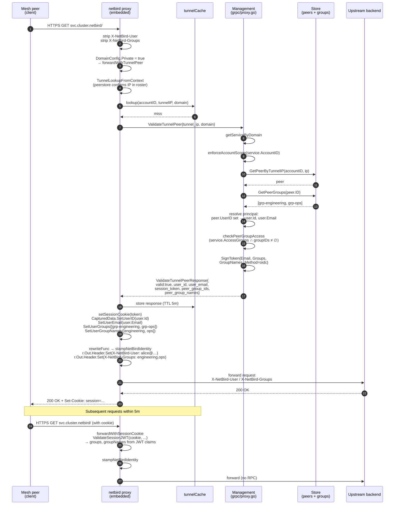
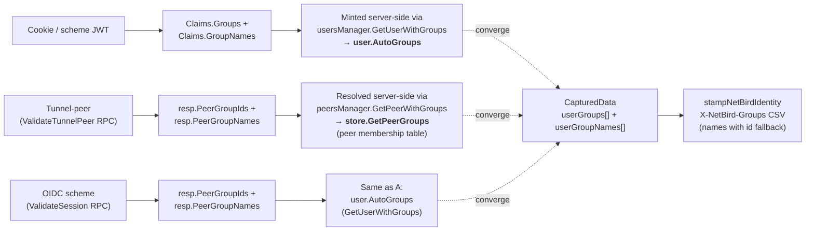

# Private-service authentication

End-to-end picture of how a request to a NetBird-only ("private") service
is authenticated, how the principal (user / peer / machine agent) is
resolved, where group memberships come from, and how the upstream
backend ends up with the `X-NetBird-User` + `X-NetBird-Groups` identity
headers.

## Full flow

```mermaid
flowchart TD
    REQ[/"Inbound HTTPS request<br/>(mesh peer → proxy on tunnel IP)"/]:::client
    STRIP["middleware.Protect<br/><i>anti-spoof: strip X-NetBird-User / -Groups</i>"]:::strip
    REQ --> STRIP

    STRIP --> BRANCH{"DomainConfig<br/>.Private?"}

    %% =============== PRIVATE PATH ===============
    BRANCH -->|"true"| TUN["forwardWithTunnelPeer"]:::proxy
    TUN --> IP["Resolve client IP<br/>(X-Forwarded-For / RemoteAddr)<br/>must be tunnel CIDR"]:::proxy
    IP --> LOCAL{"TunnelLookupFromContext<br/>IP in account roster?"}
    LOCAL -->|"no"| DENYFAST["return false<br/>(no RPC; fall through)"]:::deny
    LOCAL -->|"yes"| CACHE{"tunnelCache hit?<br/>(5 min TTL, single-flight)"}
    CACHE -->|"yes — valid"| CACHED["Use cached<br/>ValidateTunnelPeerResponse"]:::proxy
    CACHE -->|"miss / expired"| RPC["gRPC ValidateTunnelPeer<br/>(tunnel_ip, domain)"]:::proxy

    %% =============== MANAGEMENT ===============
    RPC --> VTP_START["ValidateTunnelPeer"]:::mgmt

    subgraph MGMT["MANAGEMENT — grpc/proxy.go"]
        direction TB
        VTP_START --> SVC["getServiceByDomain(domain)"]:::mgmt
        SVC --> SCOPE["enforceAccountScope<br/>(BYOP token must match<br/>service.AccountID)"]:::mgmt
        SCOPE --> PEER["peersManager<br/>.GetPeerByTunnelIP(accountID, ip)"]:::mgmt
        PEER --> PG["peersManager<br/>.GetPeerWithGroups<br/><i>= store.GetPeerGroups(peer.ID)</i><br/><b>peer-side memberships</b>"]:::mgmt
        PG --> PRIN{"peer.UserID set?"}
        PRIN -->|"yes — human peer"| HUMAN["principalID = user.Id<br/>displayIdentity = user.Email"]:::mgmt
        PRIN -->|"no — machine agent"| MACH["principalID = peer.ID<br/>displayIdentity = peer.Name"]:::mgmt
        HUMAN --> ACC["checkPeerGroupAccess<br/>service.AccessGroups<br/>∩ peer groupIDs ?"]:::mgmt
        MACH --> ACC
        ACC -->|"no match"| DENIED["denied_reason:<br/>not_in_group"]:::deny
        ACC -->|"intersect"| MINT["generateSessionToken<br/>sessionkey.SignToken{<br/>  Email, Groups, GroupNames,<br/>  Method=oidc<br/>}"]:::mgmt
        MINT --> RESP["return ValidateTunnelPeerResponse<br/>{valid, user_id, user_email,<br/> session_token,<br/> peer_group_ids,<br/> peer_group_names}"]:::mgmt
    end

    %% =============== POST-VALIDATE ===============
    CACHED --> APPLY
    RESP --> APPLY["setSessionCookie(token)<br/>populate CapturedData:<br/>UserID, UserEmail,<br/>UserGroups, UserGroupNames,<br/>AuthMethod=oidc"]:::proxy
    DENIED --> RETURN403["return 403<br/>access denied page"]:::deny

    %% =============== COOKIE / SCHEME PATH ===============
    BRANCH -->|"false / no schemes"| COOKIE{"Session cookie<br/>present?"}
    COOKIE -->|"yes"| FSCOOKIE["forwardWithSessionCookie"]:::proxy
    FSCOOKIE --> JWT["auth.ValidateSessionJWT<br/>(cookie, host, pubKey)<br/>→ userID, email, method,<br/>  groups, groupNames"]:::proxy
    JWT --> APPLY

    COOKIE -->|"no"| SCHEMES["authenticateWithSchemes<br/>(PIN / Password / Header / OIDC)"]:::proxy
    SCHEMES --> SCHEMETOK{"Token validated by<br/>any scheme?"}
    SCHEMETOK -->|"OIDC"| VSESS["gRPC ValidateSession<br/>(uses GetUserWithGroups → user.AutoGroups)"]:::mgmt
    SCHEMETOK -->|"local schemes<br/>PIN/Pwd/Header"| LOCALJWT["validateSessionToken<br/>→ ValidateSessionJWT locally"]:::proxy
    VSESS --> APPLY
    LOCALJWT --> APPLY

    %% =============== STAMP ===============
    APPLY --> NEXT["next.ServeHTTP(r)"]:::proxy
    NEXT --> RPROXY["ReverseProxy.rewriteFunc"]:::proxy
    RPROXY --> STAMP["stampNetBirdIdentity(r)"]:::stamp
    STAMP --> STRIP_OUT["r.Out.Header.Del(X-NetBird-User)<br/>r.Out.Header.Del(X-NetBird-Groups)<br/><i>always — defence in depth</i>"]:::strip
    STRIP_OUT --> EMAIL{"CapturedData<br/>.userEmail != ''?"}
    EMAIL -->|"yes"| SETUSER["r.Out.Header.Set<br/>X-NetBird-User = email"]:::stamp
    EMAIL -->|"no (machine peer)"| GR
    SETUSER --> GR{"len(userGroups) > 0?"}
    GR -->|"no"| OUT["Forward to upstream<br/>(no group header)"]:::backend
    GR -->|"yes"| LABELS["for i, id := range userGroups:<br/>labels[i] = userGroupNames[i]<br/>            ?? id (fallback)"]:::stamp
    LABELS --> SETGR["r.Out.Header.Set<br/>X-NetBird-Groups = CSV(labels)"]:::stamp
    SETGR --> BACKEND["Upstream backend receives:<br/>X-NetBird-User: alice@netbird.io<br/>X-NetBird-Groups: engineering,ops"]:::backend

    DENYFAST --> SCHEMES

    %% =============== STYLES ===============
    classDef client fill:#1f2937,color:#fff,stroke:#3b82f6,stroke-width:2px
    classDef proxy fill:#0f172a,color:#fff,stroke:#22d3ee,stroke-width:1.5px
    classDef mgmt fill:#1e1b4b,color:#fff,stroke:#a78bfa,stroke-width:1.5px
    classDef stamp fill:#064e3b,color:#fff,stroke:#34d399,stroke-width:2px
    classDef strip fill:#7c2d12,color:#fff,stroke:#fb923c,stroke-width:1.5px
    classDef deny fill:#7f1d1d,color:#fff,stroke:#ef4444,stroke-width:1.5px
    classDef backend fill:#365314,color:#fff,stroke:#84cc16,stroke-width:2px
```



## Sequence — happy path (first request + cached follow-up)



## Source of groups by code path



## Reference table — paths, sources, caching

| Path | Where groups come from | Resolved at | Caching |
|---|---|---|---|
| **Tunnel peer** (`forwardWithTunnelPeer`) | `store.GetPeerGroups(peer.ID)` — peer's own membership table (`group_peers`) | Each `ValidateTunnelPeer` RPC | 5-min `tunnelCache` keyed by (`accountID`, `tunnelIP`, `domain`); single-flight |
| **Session cookie** (`forwardWithSessionCookie`) | JWT claims: `Groups` + `GroupNames` | Frozen at JWT mint time | Lives until cookie TTL |
| **Scheme OIDC** (`validateSessionToken` → `ValidateSession`) | `usersManager.GetUserWithGroups(userID)` — `user.AutoGroups` resolved to `*types.Group` | Per request to mgmt | None at the proxy; cookie path takes over after first hit |
| **Scheme PIN / Password / Header** (`validateSessionToken` → local JWT) | JWT claims (same as cookie) | Frozen at JWT mint time | n/a |

## Principal resolution (tunnel-peer path)

```
peer.UserID == ""                 │  peer.UserID != "" & lookup OK
(machine / automation agent)      │  (human-attached peer)
                                  │
 principalID = peer.ID            │   principalID = user.Id
 X-NetBird-User = peer.Name       │   X-NetBird-User = user.Email
                                  │
 (one principal per machine)      │   (multiple peers owned by the same user
                                  │    share one identity for spend/audit)
```

A machine agent without a `User` still receives full group context — groups
come from the peer itself, not the absent user. Email is `peer.Name`
(typically a hostname) so audit logs and spend dashboards get a stable,
human-readable key per principal.

## JWT claim shape (session cookie minted by management)

`sessionkey.SignToken` embeds:

```
Claims {
  Subject:    principalID        // peer.ID or user.Id
  Issuer:     "netbird-proxy"
  Audience:   service.Domain
  Email:      displayIdentity    // user.Email or peer.Name
  Groups:     groupIDs           // positional with GroupNames
  GroupNames: groupNames         // human-readable, paired with Groups
  Method:     "oidc"             // for the tunnel-peer fast-path
}
```

The proxy hands the JWT to the client as `Set-Cookie: session=<jwt>`.
Subsequent requests on the same session bypass `ValidateTunnelPeer`
entirely — the proxy verifies the JWT signature with
`service.SessionPublicKey` and lifts the claims straight back into
`CapturedData`.

## Header stamping rules

`proxy/internal/proxy/reverseproxy.go::stampNetBirdIdentity` is the only
place that writes `X-NetBird-*` headers:

```go
r.Out.Header.Del(headerNetBirdUser)     // always — even when CapturedData is nil
r.Out.Header.Del(headerNetBirdGroups)   // always

cd := CapturedDataFromContext(r.In.Context())
if cd == nil { return }                  // strip-only when no auth ran

if email := cd.GetUserEmail(); email != "" {
    r.Out.Header.Set(headerNetBirdUser, email)
}

groupIDs := cd.GetUserGroups()
if len(groupIDs) == 0 { return }
groupNames := cd.GetUserGroupNames()
labels := make([]string, len(groupIDs))
for i, id := range groupIDs {
    if i < len(groupNames) && groupNames[i] != "" {
        labels[i] = groupNames[i]
        continue
    }
    labels[i] = id                       // fallback when name missing
}
r.Out.Header.Set(headerNetBirdGroups, strings.Join(labels, ","))
```

Behaviour table:

| `CapturedData` state | `X-NetBird-User` | `X-NetBird-Groups` |
|---|---|---|
| nil (no auth ran) | stripped, unset | stripped, unset |
| email set, groups empty | set to email | stripped, unset |
| email empty, groups set (machine agent) | stripped, unset | set, CSV of names |
| both set | set to email | set, CSV of names |
| name missing for position `i` | n/a | label `i` falls back to group id |

## Defence-in-depth layers

```
┌──────────────────────────────────────────────────────────────────┐
│ Inbound TLS / HTTP termination on per-account WG listener        │
│ (proxy/inbound.go binds netstack :443/:80)                        │
└──────────────────────────────────┬───────────────────────────────┘
                                   ▼
            ┌──────────────────────────────────────┐
            │ Domain.Private → forwardWithTunnelPeer│
            └──────────────────┬───────────────────┘
                               ▼
            ┌──────────────────────────────────────┐
            │ Local peerstore fast-deny             │  (no RPC if not in roster)
            └──────────────────┬───────────────────┘
                               ▼
            ┌──────────────────────────────────────┐
            │ tunnelCache lookup (5 min TTL)        │  (no RPC if cached valid)
            └──────────────────┬───────────────────┘
                               ▼
            ┌──────────────────────────────────────┐
            │ gRPC ValidateTunnelPeer (mgmt)        │
            │  └─ enforceAccountScope               │
            │  └─ peer + groups lookup              │
            │  └─ checkPeerGroupAccess vs           │
            │     service.AccessGroups              │
            │  └─ mint session JWT                  │
            └──────────────────┬───────────────────┘
                               ▼
            ┌──────────────────────────────────────┐
            │ setSessionCookie + CapturedData       │
            └──────────────────┬───────────────────┘
                               ▼
            ┌──────────────────────────────────────┐
            │ stampNetBirdIdentity on r.Out         │
            │  → X-NetBird-User / X-NetBird-Groups  │
            └──────────────────┬───────────────────┘
                               ▼
                       Upstream backend
```

The **firewall** (synthetic ACL from
`account.injectPrivateServicePolicies`) blocks the connection at
WireGuard level before it even reaches the proxy. The **proxy-side
group check** (`checkPeerGroupAccess`) is a defence-in-depth
re-validation in case the firewall path is misconfigured or out of
sync. Both sources gate on the same `service.AccessGroups`.

## Anti-spoof discipline

1. **Always strip first.** `stampNetBirdIdentity` calls
   `r.Out.Header.Del(...)` for both headers before any conditional
   `Set`. A client sending `X-NetBird-User: admin@evil` never reaches
   the backend, even when no identity gets stamped.
2. **No client-controlled path writes these headers.** The Set sites
   are only inside `rewriteFunc` after the auth middleware has
   populated `CapturedData` server-side.
3. **`CapturedData` is request-scoped.** Each request creates a fresh
   instance in context; there's no cross-request state to poison.
4. **BYOP account scope.** `enforceAccountScope` blocks BYOP tokens
   from minting cookies for another account's private service —
   the RPC returns `codes.PermissionDenied`.

## Relevant files

| Concern | File |
|---|---|
| Strip + dispatch + cookie/scheme paths | `proxy/internal/auth/middleware.go` |
| Tunnel-peer cache (single-flight, TTL) | `proxy/internal/auth/tunnel_cache.go` |
| `ValidateTunnelPeer` RPC + group check | `management/internals/shared/grpc/proxy.go` |
| Session JWT mint + claims | `management/internals/modules/reverseproxy/sessionkey/sessionkey.go` |
| Peer membership lookup | `management/internals/modules/peers/manager.go` (`GetPeerWithGroups`) |
| User auto-groups lookup | `management/server/users/manager.go` (`GetUserWithGroups`) |
| Synthetic ACL (firewall layer) | `management/server/types/account.go::injectPrivateServicePolicies` |
| Captured identity store | `proxy/internal/proxy/context.go` |
| Header stamping | `proxy/internal/proxy/reverseproxy.go::stampNetBirdIdentity` |
| Per-account WG listener | `proxy/inbound.go` |
